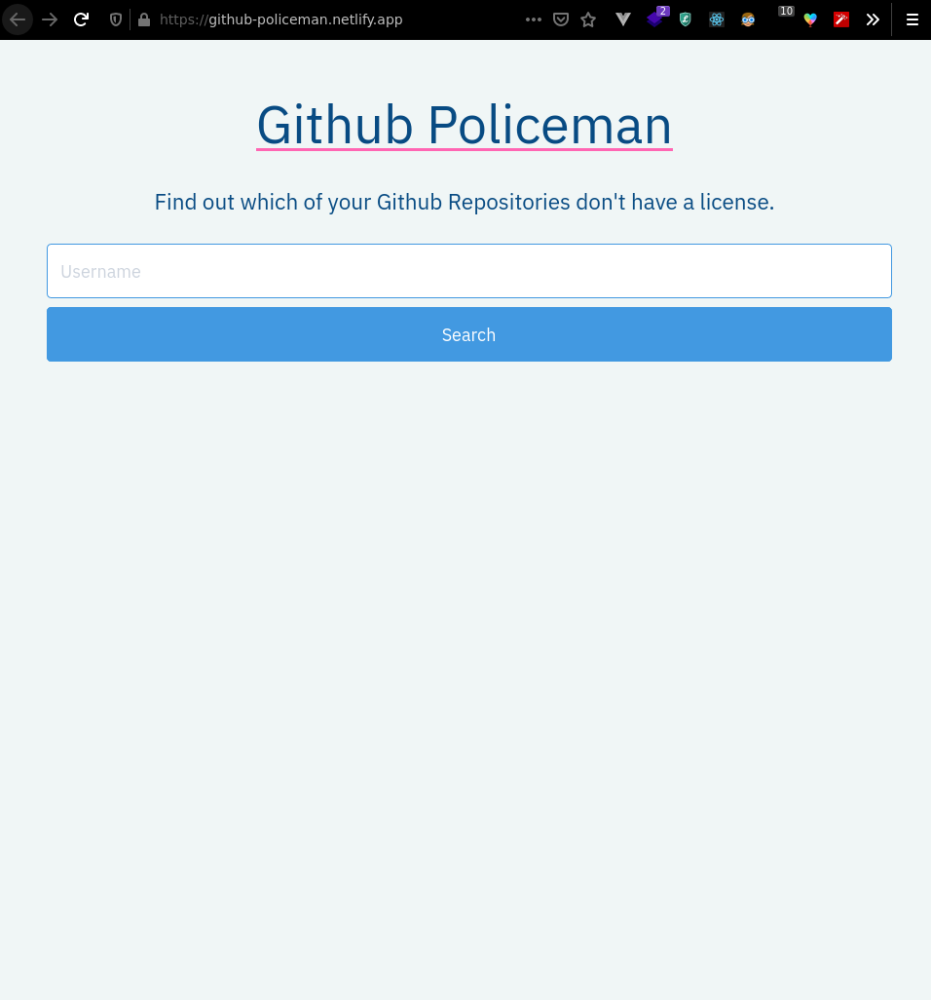
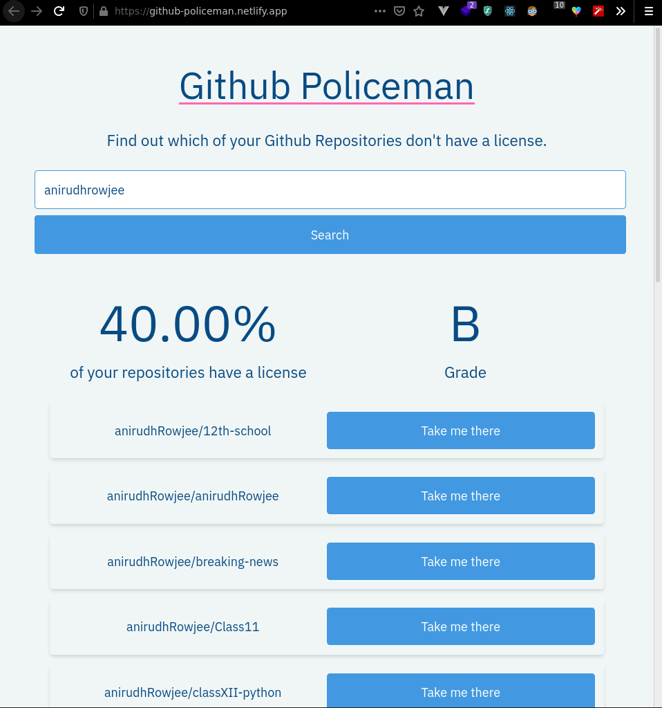

# Github-Policeman

This is a website which tells you which of your public Github Repositories do not have a `LICENSE` yet.

## Stack
* React
* Axios
* TailwindCSS

## Images

## Install Steps

* Clone this repository
* `cd github-policeman`
* `npm install`
* `npm start`
